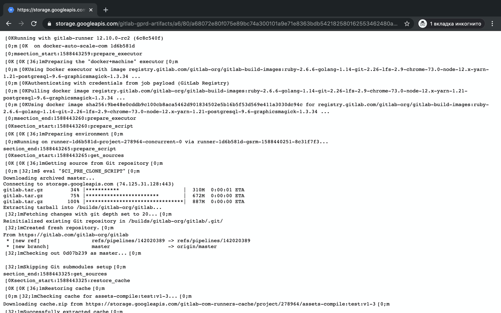

  

<h1 align="center">GTLB CI logs viewer</h1>
<h4 align="center">Disclaimer: it's not an offical GitLab extension</h3>

> [Browser extension](https://chrome.google.com/webstore/detail/gitlab-ci-logs-viewer/mjjniaplbhdjmhkmfknkbemfjghofaff) for code highlighting raw logs in GItlab CI

If you have large logs Gitlab will show only part of it. Gitlab has a link to the full log but it's completely unusable due of lack ANSI code highlighting and text formatting. This extension parses ANSI codes and shows full logs with code highlighting.

It works with self-hosted Gitlab instances for links like http(s)://*your-gitlab-hostname*/*path-to-project*/-/jobs/*job-number*/raw and with gitlab.com.

## How it looks

  wihtout extension
  

---------

  with extension
  

## How to install

[Chrome web store](https://chrome.google.com/webstore/detail/gtlb-ci-logs-viewer/mjjniaplbhdjmhkmfknkbemfjghofaff)
