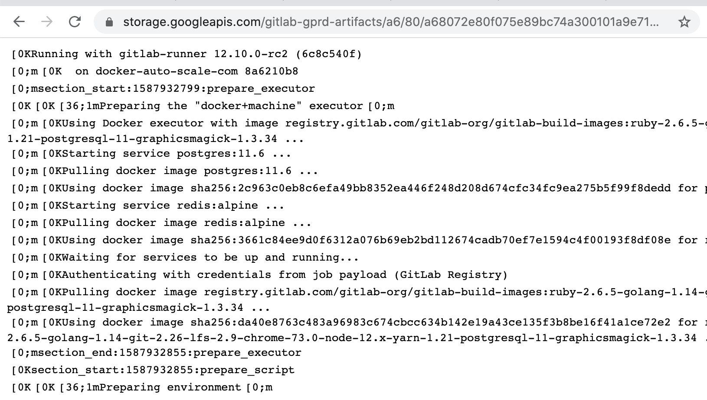
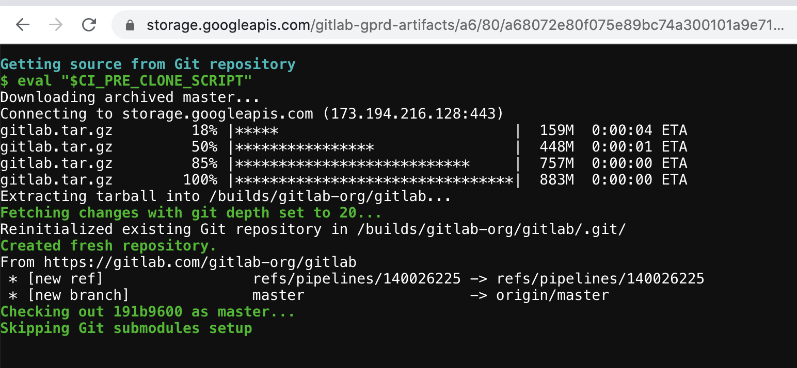

  

<h1 align="center">Gitlab CI logs viewer</h1>

> Browser extension for code highlighting raw logs in GItlab CI

If you have large logs Gitlab will show only part of it. Gitlab has a link to the full log but it's completely unusable due of lack ANSI code highlight and text formatting. This extension parses ANSI codes and shows your's full logs with code highlights.

It works with self-hosted Gitlab instances for links like http://*your-gitlab-hostname*/*path-to-project*/-/jobs/*job-number*/raw and with gitlab.com.

## How it looks

wihtout extenison

---------

with extenison

## How to install

### Chrome Web Store

> Currently it is passing review in Chrome Web Store

### Manual

1. Download extension archive [v0.0.1.zip](https://github.com/7rulnik/gitlab-job-log-viewer/releases/download/v0.0.1/v0.0.1.zip)
2. Unarchive it
3. Open [chrome://extensions/](chrome://extensions/)
4. Turn on **Developer mode** in upper right corner
5. Drag and drop unarchived folder

# TODO

- [ ] Publish in diffrent broswer's stores
- [ ] Fix section's durations and add some styles for it
- [ ] Parse links
- [ ] Custom highlight color schemes and fonts

